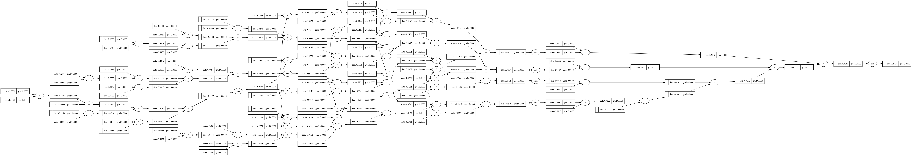

# Micrograd from Scratch — A Tiny Autograd Engine


Author: [Andrew Gyakobo](https://github.com/Gyakobo)

## Introduction

This is a minimal, from-scratch implementation of a scalar-valued **automatic differentiation (autograd) engine** and a small neural network library built on top of it. It follows the ideas behind Andrej Karpathy's [micrograd](https://github.com/karpathy/micrograd), rebuilt line by line to actually understand how backpropagation works — not just call it.

The whole engine is a single `Value` class that tracks a computation graph as you do math on it, then walks that graph backwards to compute gradients via the chain rule. That's the same principle powering PyTorch and TensorFlow, minus the tensors and the GPU.

> A companion write-up is on the way — [Medium post](https://medium.com/@andygyakobo) *(link coming soon)*.

## Installation

```bash
git clone https://github.com/Gyakobo/Micrograd-from-scratch.git
cd Micrograd-from-scratch
pip install -r requirements.txt
```

The core engine (`value.py`, `neuron.py`) is pure Python and needs no dependencies. `numpy` and `matplotlib` are used for the demos, and `graphviz` is used to visualize the computation graph.

## Quick Start

```python
from value import Value

# Build an expression — the graph is tracked automatically
a = Value(2.0, label="a")
b = Value(-3.0, label="b")
c = Value(10.0, label="c")

d = a * b + c        # d = 2*-3 + 10 = 4
e = d.tanh()         # squash it

e.backward()         # compute gradients for every node

print(a.grad)        # d(e)/d(a)
print(b.grad)        # d(e)/d(b)
```

Calling `.backward()` on the final node fills in `.grad` on every value that contributed to it.

## How It Works

### 1. The `Value` object

Every number is wrapped in a `Value` that stores:

- `data` — the actual number
- `grad` — the gradient of the final output with respect to this value (starts at `0.0`)
- `_prev` — the child nodes that produced it (the graph edges)
- `_backward` — a closure that knows how to push gradients to its children

### 2. Operations build the graph

Each supported operation (`+`, `*`, `**`, `tanh`, `exp`, and the derived `-`, `/`) returns a **new** `Value` and records how to backpropagate through itself. For example, multiplication applies the chain rule locally:

```python
def _backward():
    self.grad  += other.data * out.grad
    other.grad += self.data  * out.grad
```

Gradients are **accumulated** (`+=`, not `=`) so that a value used in more than one place gets the sum of all its gradient paths — which is exactly what the multivariable chain rule requires.

### 3. Backpropagation

`backward()` topologically sorts the graph so every node comes after its children, seeds the output gradient to `1.0`, then calls each node's `_backward()` in reverse order:

```python
def backward(self):
    topo, visited = [], set()

    def build_topo(v):
        if v not in visited:
            visited.add(v)
            for child in v._prev:
                build_topo(child)
            topo.append(v)

    build_topo(self)
    self.grad = 1.0
    for node in reversed(topo):
        node._backward()
```

### 4. A tiny neural net

`neuron.py` builds a small multi-layer perceptron entirely out of `Value` objects:

- **`Neuron`** — computes `tanh(w · x + b)`
- **`Layer`** — a list of neurons
- **`MLP`** — a stack of layers

Every weight and bias is a `Value`, so gradients flow through the whole network for free.

## Training Example

A full gradient-descent loop using the engine:

```python
from neuron import MLP

# 3 inputs -> two hidden layers of 4 -> 1 output
n = MLP(3, [4, 4, 1])

xs = [
    [2.0,  3.0, -1.0],
    [3.0, -1.0,  0.5],
    [0.5,  1.0,  1.0],
    [1.0,  1.0, -1.0],
]
ys = [1.0, -1.0, -1.0, 1.0]   # desired targets

for k in range(50):
    # forward pass
    ypred = [n(x) for x in xs]
    loss = sum((yout - ygt) ** 2 for ygt, yout in zip(ys, ypred))

    # backward pass — zero grads first (they accumulate!)
    for p in n.parameters():
        p.grad = 0.0
    loss.backward()

    # nudge every parameter downhill
    for p in n.parameters():
        p.data += -0.05 * p.grad

    print(k, loss.data)
```

The loss should shrink toward zero as the network learns to match the targets. The one non-obvious step is resetting `p.grad = 0.0` each iteration — since gradients accumulate, skipping this would mix in stale gradients from previous steps.

## Visualizing the Computation Graph

`digraph.py` uses Graphviz to draw the expression graph, showing each value's `data` and `grad`. It's the fastest way to *see* backprop working.



## Project Structure

```
.
├── value.py            # The Value autograd engine
├── neuron.py           # Neuron / Layer / MLP built on Value
├── digraph.py          # Graphviz visualization of the graph
├── main.py             # Demos and a training example
├── learning_tensors.py # Scratch experiments
└── requirements.txt
```

## Acknowledgements

Inspired by Andrej Karpathy's [micrograd](https://github.com/karpathy/micrograd) and his excellent [Neural Networks: Zero to Hero](https://www.youtube.com/playlist?list=PLAqhIrjkxbuWI23v9cThsA9GvCAUhRvKZ) series.

## License

MIT

## Contributing

Suggestions and improvements welcome — open an issue or a pull request.